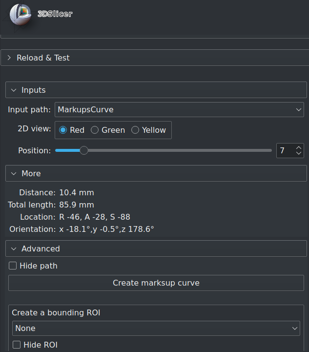

# CrossSectionAnalysis module

This [Slicer](https://www.slicer.org/) module uses the Reformat module to move a selected 2D view along a path, and to incline the plane at right angle to the path. It is intended to view cross-sections of blood vessels.

The view's position and orientation are dynamically reported.

**Usage**

Select a markup curve or a VMTK centerline model, and a 2D view.

Move the slider bar to reformat the view. Optionally, change the point for relative distance calculation.

**Comments**

Visual comfort of the reformated displacement is as smooth as the curve is. There should not be hundreds of points constituting the path ( point here is not the regularly spaced balls seen on screen).

Best result is obtained with markup curves. These can also be resampled to fewer points. [VMTK](https://github.com/vmtk/SlicerExtension-VMTK) centerline models cannot be resampled.

The markup curve can be a computed result, like those of [VMTK](https://github.com/vmtk/SlicerExtension-VMTK) centerline markups. It can also be hand-drawn. The latter approach can  be appropriate for quick reformated visualization of a short segment of sinuous arteries, like the iliacs and subclavians.

The Reformat widget can be optionally displayed in the 3D view.

For VMTK centerline models only, the diameter at the location on the path is also shown.

*N.B : do not confuse VMTK centerline markups and models.*

**Markup curve editing**

The reformatted view is updated upon markup point displacement, addition and deletion.

New markup curves can be created inplace.

Point addition goes to the selected markup curve.

**ROI helper**

As a convenience, an ROI can be created in-place. It is centered on the selected path, and its bounding box is strictly that of the path. It can then be used in other modules like Local Threshold or Crop Volume.

The typical use case is : axial arterial analysis along a manually created markup curve, followed by segment creation within the curve bounds in a huge volume node.

**Disclaimer**

Use at your own risks.

*Update*

*This module is renamed from PathReformat to CrossSectionAnalysis for inclusion in Slicer's VMTK extension.*

